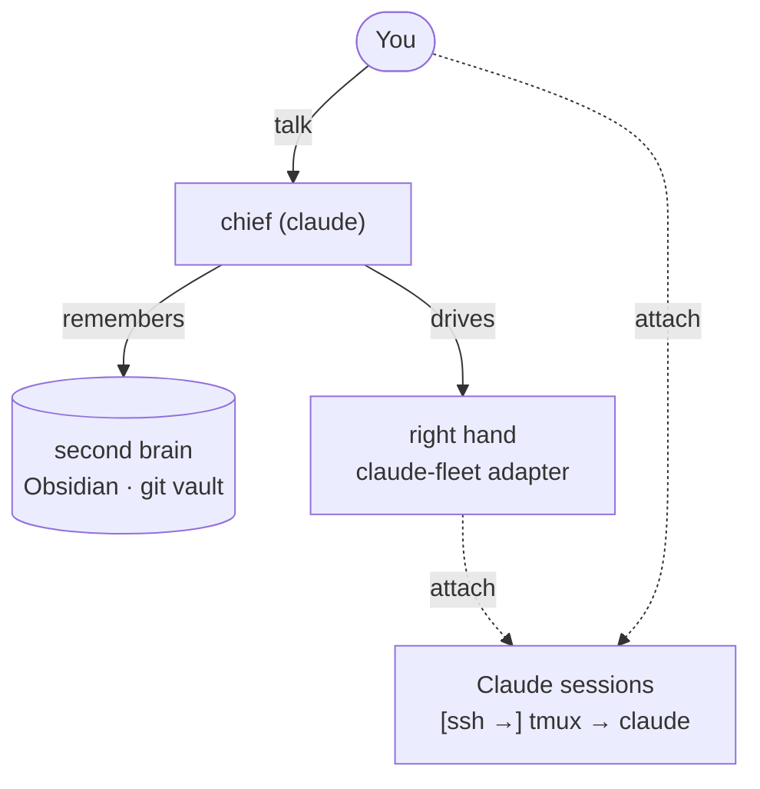

# Chief

A setup that turns [Claude Code](https://claude.com/claude-code) into your **chief of staff**. Two jobs:

1. **Second brain** — its memory: a folder of Markdown notes (a planner, a card per project, a daily brief) that you talk into and it keeps current. Just files, readable and editable in any editor; [Obsidian](https://obsidian.md) is the nice one.
2. **Right hand** — its hands: the `.claude/` toolkit of skills and agents, plus an adapter that drives Claude Code sessions in your own repos, on this machine or another. You can **attach** to any of them — drop into the same terminal session it is driving and take the keyboard.

The notes grow as you talk to it; the toolkit grows as the work calls for it.

## Setup — the institution

The way this team works is written in [`INSTITUTION.md`](INSTITUTION.md): three levels, one lifecycle, four review lenses.

- **The three levels** are CTO (*why* — the vision), lead (*what* — the roadmap), engineer (*how* — the build). An agent can fill any of them.
- **The four lenses** are the stances a reviewer puts on for someone else's work: peer/expert, adversary, fact-checker, editor. **One lens per reviewer**, and the convenor picks which the artifact needs — seats are a cost.
- **You are the founder** — the human the whole thing answers to, above all three levels. Chief holds the CTO level; the levels below it are agents.

Adopting it is four steps, and the fourth is where it starts doing anything.

1. **Get it, and turn the push guard on:**

   ```
   git clone https://github.com/kengz/chief.git && cd chief
   git config core.hooksPath .githooks   # git ignores the directory until you say this
   ```

   The institution itself is **four skills** — `north-star`, `lead-role`, `review`, `writing` — and
   **five agents**: the engineer and the four review lenses. Alongside them `.claude/` also holds
   the vault's own operating skills — the daily brief, calendar, sync and remote control — which
   are useful but not part of the institution. A clone is enough; a session in this repo loads them from `.claude/`.

2. **Each project repo declares its session a lead** with one line near the top of its own `CLAUDE.md`: **You are the LEAD of this project. Load the `lead-role` skill now and work to it.** A pointer, not a pasted copy, so the role is rewritten in one place and every repo gets it.

3. **Give that project the three documents the lead role expects**, in the repo, before you dispatch anything:

   - a **north star** — what the project is for, what would show it was wrong, what it is not doing;
   - a **roadmap** — that expanded into an ordered list of steps, each a bounded piece of work carrying a question that could come back either way;
   - a **work list** — `WORK_LIST.md`, beside the roadmap, one row per step, each `next` · `in flight` · `blocked-on(<who>)` · `done`.

   Ask the session to draft all three from a paragraph of context and correct what it writes. Until they exist the lead has no queue, and a lead with no queue idles — which the institution treats as a defect rather than a state.

4. **One thing runs:** `.githooks/pre-push`, turned on by the `git config` line
   above. It refuses to push to any remote you have not explicitly trusted, because this vault
   fills up with real content and nothing should leave the machine by accident.

**Start smaller if you want.** The four review lenses in `.claude/agents/` and the `writing` skill are self-contained and pay from day one; the three level-skills assume a team with more than one session.

## Usage

You cloned it above. Run `claude` from inside the folder and that's Chief. (Fork it instead if you want your own remote to sync from; a zip download works for one machine with no sync.)

From there, it's mostly just chat — a few threads worth naming:

- **Brief** — say *"morning"* for your daily brief: Chief archives yesterday, clears done items, and refreshes Today (agenda + inbox), intel, and project status into `planner.md`.
- **Chat** — talk to Chief about anything (*"what's next?"*, *"add this doc"*); it lands in your vault — your **planner** (`planner.md`: Today, Focus, Projects), to read and edit.
- **Dispatch** — just ask: *"fix the failing tests in project X"*, *"run something on a box"*. Chief works in your real repos and machines, never the vault.
- **Take over** — ask Chief for a session's handle and `attach` to take the wheel.

**Handy commands:**
- **`/remote-control`** — drive a session running on a box from the Claude app (or claude.ai/code), on any device — your phone as a remote. Chief sets it up for you.
- **`/goal`** — hand Chief a bounded objective; it self-drives to completion, checking in only as needed (this is how it runs the fleet).
- **`/loop`** — run a prompt or check on a recurring interval (polling, babysitting a job).

**Prerequisites:** [Claude Code](https://claude.com/claude-code). Optional: [Obsidian](https://obsidian.md) for real-time sync to all your devices, a **private** GitHub repo to sync across machines, and [claude-fleet](https://github.com/kengz/claude-fleet) for a remote fleet.

### Sync

The vault is just a folder, so **sync is optional** — one machine needs none. To run across machines, **Chief sets up sync for you** (the `sync-setup` skill). Two routes, for reference:

- **git** — free, not real-time. Carries the **toolkit** to your **private** repo. The `.gitignore` is default-deny, and the only notes it names are the four filled-in ones you overwrite on day one. Untrack those (`git rm --cached`) once they are yours, and nothing you write is ever committed, so a leak of the repo exposes none of it.
- **[Obsidian Sync](https://obsidian.md/sync)** — paid, real-time, reaches your phone. Carries **the notes**, end to end, without them ever touching a git remote.

The split is the point. Share the toolkit; keep the content.

### Fleet (optional)

To drive Claude across other machines, just ask Chief to **set up the fleet**. It clones [claude-fleet](https://github.com/kengz/claude-fleet) — a separate repo, not copied into this vault — puts its CLI on PATH, and writes your `~/.config/claude-fleet/fleet.conf`, asking only for host details it cannot assume.

From then on the **Fleet** protocol in `CLAUDE.md` just works; local sessions need no remote at all.

The one bit you do by hand (optional): to also load claude-fleet as a Claude Code **plugin** — interactive slash commands an agent can't run for you — type:

```
/plugin marketplace add kengz/claude-fleet
/plugin install claude-fleet
```

That loads the claude-fleet skill alongside the CLI. It's optional — Chief operates the fleet from the CLI alone.

## How it works

**Chief's premise:** native Claude Code features + good general principles + a few salient tools and the vault structure — not a pile of bespoke per-task tooling.

At its simplest, Chief is just the **second brain** — a Markdown vault you read, write, and get briefed from; a complete way to use it on its own, no agents or machines. One repo:

```
chief/
├── CLAUDE.md       its instructions (ends with @index.md)
├── INSTITUTION.md  how the team runs — roles, lifecycle, principles
├── index.md        the always-loaded map, pointing at everything else
├── planner.md      your planner — Focus + today's brief
├── fleet.md        what work is in flight, and on which machine
├── inbox/          raw capture
├── projects/       one thin card per sibling repo
├── areas/          ongoing life threads
├── archive/daily/  dated planner.md history
└── .claude/        skills · agents · settings (the toolkit)
```

**The tracked files are a worked-through starting point — overwrite them with your own.** Everything you add afterwards is git-ignored, so notes never leave your machine unless you choose a remote.

The vault (`planner.md`, `projects/`, `inbox/`, `areas/`) is the memory; `CLAUDE.md` + `.claude/` (derived from [good-code](https://github.com/kengz/good-code)) are the right hand's instructions and tools. Code never lives here — Chief reaches your repos through thin *cards*.

The **right hand** is Chief running work for you — directly in the conversation, or by driving Claude sessions where your code and machines live. You already run Claude Code a session per project (*terminal → `claude`*); Chief drives those, **local by default**, stretching across machines for a fleet:

```
  base:                            claude   you run it (local)
  remote:             ssh → tmux → claude   on another machine
  chief:  adapter → [ssh →] tmux → claude   Chief drives it
```

Wrap a Claude session in `tmux` (plus `ssh` for a remote box) and it becomes a durable surface. Chief drives that **same** session through its adapter ([claude-fleet](https://github.com/kengz/claude-fleet), a stateless CLI + plugin) — exactly as you would by hand — so either of you can `attach` and take over, anytime.



Going remote is optional — it just adds the `ssh` hop; the full protocol lives in `CLAUDE.md`'s **Fleet** section. Standing up a box — Tailscale access, a hardened `sshd`, your dotfiles, and Claude Code in `tmux` — is standard setup Chief handles for you, no special repo required.

## Make it yours

That's it — it's **yours**. Once you understand it, it's just Claude as your chief of staff: a second brain for your notes, a right hand on your repos and machines — one that grows the more you use it. Grow the vault, add the skills, agents, and tools your work needs, make it your own.

## License

[MIT](LICENSE) © kengz
